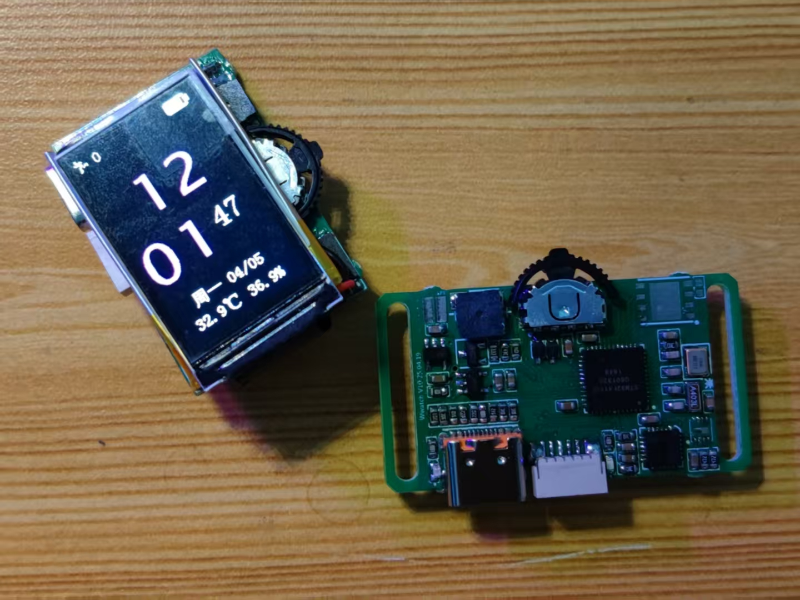

##### 注：程序运行在基于watchT V3的版本上。相比较之前的V2版本的PCB，V3版本对所有的期间都进行了重新布局，但是所有的引脚对应编号都没有改变。由于之前发现充电时，撒热电阻 发热严重，在V3版本上面把散热电阻移动到PCB边缘，远离屏幕。同时增加了PCB底板。底板上预留了一个心率血氧传感器，可以透过PCB测量人体心率和血液氧气浓度。需要一路IIC和一个输入IO，提供3.3V电源。同时为了方便连接，直接在watchT的PCB上面预留了这五个导线接口，设计直接使用导线进行焊接。另外还增加了光照传感器，改变了电池供电结构。

**注**：硬件链接 [田小呱/wwatch-hardware](https://gitee.com/tianxiaohuahua/wwatch-hardware)  !! 

#  V9.1.1

### 20.9.21 更新PCB

重新设计完成了PCB

# V10.1

#### 20.9.29

刚刚完成了PCB的调试和焊接，先前的程序已经 可以完善的运行在这个版本的PCB上面。最新的发现是这个PCB版本还是不能尽人意，一开始使用的LM27313的芯片，并不能起到升压作用。因为在上一个版本的PCB就存在了设计缺陷。电池电压没有直接得到升压的作用，而是直接绕过了升压芯片给了降压芯片为系统供电。这个版本的PCB开关只是截断了所有的器件和电池的连接。因此开关断开以后就不能充电了，也是一个严重的缺陷。下一个版本的PCB还会改进这些缺陷。

开始对光照强度传感器进行驱动。

# 适合的PCB版本更新到V4 20.10.13

# V10.2

目前PCB的各个功能模块以切正常，可以最后的代码编辑了。

更改之前的充电检测，把原来的高电平检测转换为低电平检测。

10月22日早上成功讲V4 PCB 上面的 所有硬件驱动成功！！

下一步准备把温湿度显示到主界面上，另外需要进一步改进和完善陀螺仪部分的驱动，需要增加计步算法。

10月22日晚上 已经完成了温湿度的显示以及对步数算法的实现，以及把步数显示到主界面的显示屏幕上面。完成了显示屏幕的最终显示。

明天先解决闹钟部分的Bug问题，之后解决存储部分，把数据储存到FLASH内。包括七个闹钟，七天的步数以及设置部分的数据！

还需要抬手晃动唤醒休眠。

之后还需要重新对PCB部分进行刷新设计。最好找到合适的端子，最好还可以集成一个通讯类的传感器。

# 2021年3月31日

# 更新WOKE_OUT_WATCH版本

# 更新了PCB

# 更新KEIL工程WOKE_OUT_WATCH-V1.0

PCB1对应着V1.0版本工程

在V1.0工程下更细了原有的PCB的驱动

使用SI7020芯片替代SHT30芯片作为温湿度传感器芯片并实现了驱动的更换

增加了血氧传感器及其驱动程序

# WOKE_OUT_WATCH-V1.1

替换了正点原子的驱动程序，帮助完成了初始化的驱动

更新后的初始化程序的代码不会应为角度的变换造成之后测量角度的偏差

# WOKE_OUT_WATCH-V1.2

修改了界面，更正了血氧传感器的UI

# WOKE_OUT_WATCH-V1.3

更正了电池电量检测部分。电池ADC采样后检测得到的电池电量更准确

# 22年1月29 V2.1.1

!!!此程序版本为V2.1.1，对应的硬件版本为：V2.1；
在硬件V2.1的主要配置：
    单片机使用了STM32F401CCU6 
        ARM 32-bit Cortex-M4 with FPU
        80 MHz maximum frequency
        256k flash
        64k ram
        UFQFPN 封装48pin
    主要晶振：8Mhz
    带有32.768Khz外部低速晶振
    1.14寸 TFT液晶屏幕
    使用间距为1.0mm的sh接口作为Debug接口
    配置Typec接口提供大约500ma充电电流
    电池大小为300maH
    配置三个功能按键，同时引出复位按键
    可以调音无源蜂鸣器
    

在本版本中实现了功能：

1、血样传感器心率检测，由于在PCB上改进了工艺，将血样传感器放置在手表下面进一步缩小了手表的体积，在正常同步心率状态下会在屏幕上显示心率和血样，在同步心率时候会伴随右侧灯光闪烁，闪烁频率和心跳频率一致。但传感器精度很难达到，需要多次测量。在推出学氧传感器界面后由于未关闭学氧传感器，底部灯光会一直闪烁；

2、闹钟，正常可以设置闹钟，设置闹钟时候必须在满足时间完全符合才会响起，也就是时钟数字完全对应的一分钟，使用中间按键退出闹钟；

3、游戏；继承了之前的游戏，使用陀螺仪消除像素点；

4、照明；使用所有灯光进行照明；

5、设置；在设置中可以对时间和日期声音进行设置；

后台功能实现了：

1、计步器正常记录步数，正常显示；

2、时间日期秒钟数字正常显示无延迟；

3、显示日期，显示星期；

4、显示温湿度，温湿度更新频率在一秒钟左右；

5、电池电量显示，电池在充电状态下可以正常检测到正在充电并显示充电动画；

6、在正常状态下可以实现没有操作10秒钟的时候熄灭屏幕，但是只是通过关闭背光的方式来熄灭屏幕，没有实现后台降低功耗，因此正常仅能在正常待机的50ma电流状态下减少10ma左右电流；

7、蜂鸣器可以在按键按下时候正常发出声音，可以在设置中对俺家声音进行设置。

**硬件改动**

硬件改动不大，所有硬件正常驱动。

需要的改进：

1、电源管理：将电源反馈，屏幕，血氧传感器，蜂鸣器，灯光LED，设置成一个电源开关控制，将陀螺仪单独设置电源控制。更换电源芯片。

2、简化LCD背光控制，去除三极管电路；

3、简化单片机的晶振，去掉外部晶振；

4、去掉BOOT1电阻。

